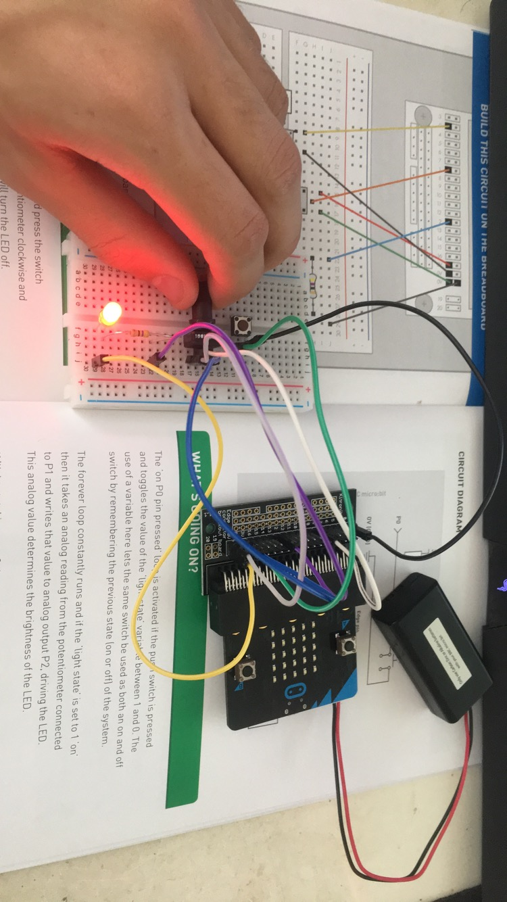

# Inventor Kit Experiments

*Markdown reference: https://guides.github.com/features/mastering-markdown/*

## Instructions ##

*For a selection of 5 inventor kit experiments that you choose, fill out the following sections.

### Setting The Tone With A Piezo Buzzer Experiment 6
 ###

(The buzzer going with different tones)

#### Reflection ####

In this experiment, something new to me was or something I learned was how easy it was to make music with minimal wires and buzzers.

This experiment could be the basis of a real world application such as a doop opening system such a elevators and other buildings such as hospitals to help with floors, or in the hospital case to say if the room is being used or is a paitent need help.

### Using A Light Sensor And Analog Inputs Experiment 2 ###

(Buzzer making tones on button press)

#### Reflection ####

In this experiment, something new to me was or something I learned was how easy it was to put the pins/wires into the wrong slot making the whole experiment not work.

This experiment could be the basis of a real world application such as a doop opening system such a elevators and other buildings such as hospitals to help with floors, or in the hospital case to say if the room is being used or is a paitent need help.

### Dimming An LED Using A Potentiometer Experiment 3 ###

(light adjust when dial is turned.)

#### Reflection ####

In this experiment, something new to me was or something I learned was how for the whole experiment to work it was crucial to have the LED facing the same way as show in the book or it would not work.

This experiment could be the basis of a real world application such as light dimming in houses

### Say "hello" to the BBC Micro Bit ###

(displaying images on button press)

#### Reflection ####

In this experiment, something new to me was or something I learned was how easy micro bits are to use a

This experiment could be the basis of a real world application such as airpots and other transportation place to help display times for planes delays etc.

### Experiment name ###

(Replace this with the experiment name)

#### Using a Transistor to drive a motor ####

(enabling a fan motor)

#### Reflection ####

In this experiment, something new to me was or something I learned was fiddly it was to put the wires into the terminal connection, this was a bit of a challenege but in the end I was able to get it.

This experiment could be the basis of a real world application such as real fans,plane motors. etc

