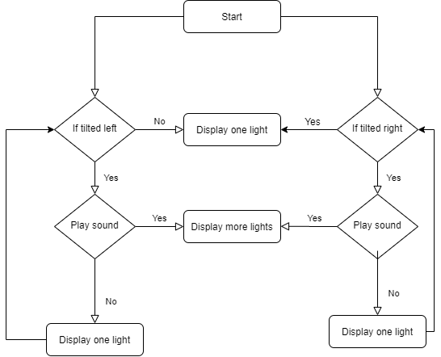
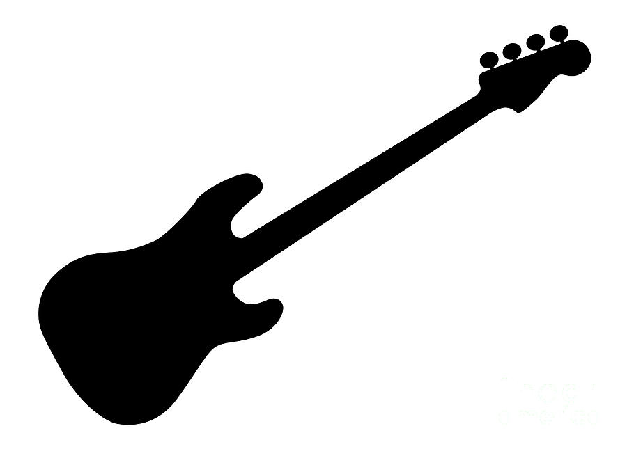
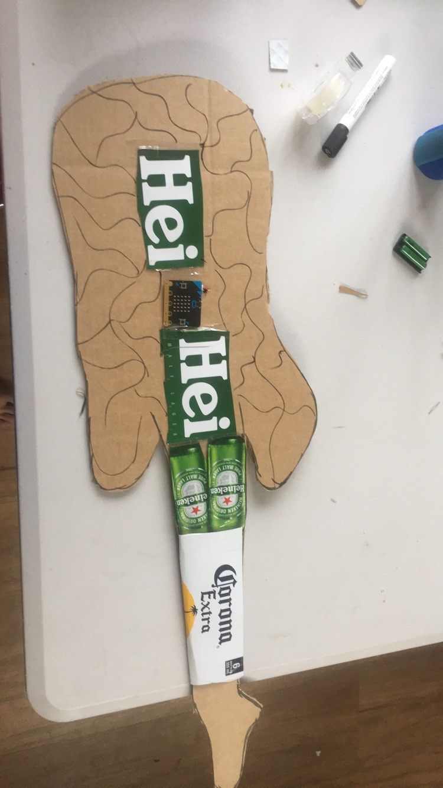
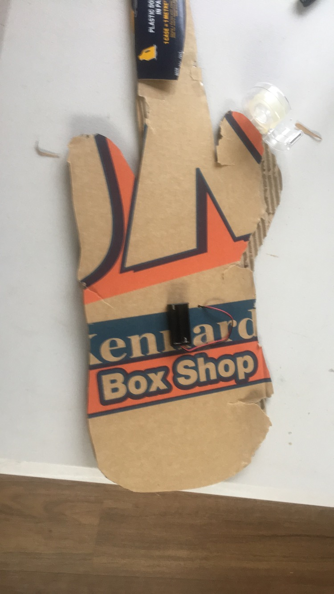

# Assessment 1: Replication project

*Fill out the following workbook with information relevant to your project.*

*Markdown reference:* [https://guides.github.com/features/mastering-markdown/](http://guides.github.com/features/mastering-markdown/)

## Assessment 1: Replication project##
(Insert the name of the project you chose to replicate.)

## Related projects ##

### Related project 1 ###
Micro:bit-Swift Musical Instrument Controller

https://www.youtube.com/watch?v=Jflf77bLC34

This project is related to mine because the video shows Peter Wallen creating a guitar/device, this is similar to mine due to Peter uses sensors to help with determing each cord. This is similar to mine due to my guitar is similar butit uses lights and its x/y position to play the cords.

### Related project 2 ###
Micro:bit-Swift Musical Instrument Controller

https://www.youtube.com/watch?v=ANvT1LmpzF8

This project is very similar to mine as the micro bit will play a chord when tiled ok a certain x/y this is what I am doing but with adding a light sensor for added sounds.

### Related project 3 ###
BBC microbit Python Circuit and Music Project

https://www.youtube.com/watch?v=rcXacFNVVb8

In this project the user takes making music to a more indepth level than compared to my guitar. This is done by adding a orange and a playdough of some sort and when pressing either one will display an image corrisponding to the item touched. this is similar to my project due to i use the buttons on the guitar to play a sound and display an image when touched.

### Related project 4 ###
Micro:bit-Swift Musical Instrument Controller

https://www.youtube.com/watch?v=ulKq5To9dmA

### Related project 5 ###
Micro:bit-Swift Musical Instrument Controller

https://www.youtube.com/watch?v=ANvT1LmpzF8

## Reading reflections ##
*Reflective reading is an important part of actually making your reading worthwhile. Don't just read the words to understand what they say: read to see how the ideas in the text fit with and potentially change your existing knowledge and maybe even conceptual frameworks. We assume you can basically figure out what the readings mean, but the more important process is to understand how that changes what you think, particularly in the context of your project.*

*For each of the assigned readings, answer the questions below.*

### Reading: Don Norman, The Design of Everyday Things, Chapter 1 (The Psychopathology of Everyday Things) ###
I had some previous understanding of Don Norman and his doors due to this was a topic I had studied last year. For example a flat surface hand on a door means to pull towards the user, However some manufacturers decided to change how this works and hence may confuse the user.

Don Norman's depictions of how the design of doors has changed and molded our general surroundings. This has changed my insight into how as a creator you collaborate with the procedure of plan. How would you plan for the human component, what signifies do you implant into configuration to ensure an individual realizes how to utilize something.

I would like to know more about how you can create more effective mapping within design and graphic design. How do you implement a natural feel to objects and graphics?

The feedback and signifiers elements relate to the project as they are ideas in my project. The instant feedback from a tap is sound. This creates

### Reading: Chapter 1 of Dan Saffer, Microinteractions: Designing with Details, Chapter 1 ###

Before perusing this section on microtransactions I never thought about how significant little detail/effect can improve and change a project.

I figured out how the interaction of all micro transactions and the macro design scale had a postivte outlook for the client. In the end the fact is that the simpler is in more ways than one the most effective way dealing with micro transactions espacily on a larger scale.
 The progression of  micro transactions is the trigger that at that point keeps on the off chance that the principles have been follwed, The client's input and afterward it circles back on itself doing an entire loop.

### Reading: Scott Sullivan, Prototyping Interactive Objects ###

Its shown in design that most creators/designs will tend to ignore/glide over the imperfections/flaws in their designs. But In Scott's reading he discusses how designers help pave the journey of their creations/designs.

I discovered that the more you are able to complete,overcome and/or acomplish a task and do the appropriate steps while doing these task you can later be able to create/designs stuff for the fun of it.

## Interaction flowchart ##

*Draw a flowchart of the interaction process in your project. Make sure you think about all the stages of interaction step-by-step. Also make sure that you consider actions a user might take that aren't what you intend in an ideal use case. Insert an image of it below. It might just be a photo of a hand-drawn sketch, not a carefully drawn digital diagram. It just needs to be legible.*

## Process documentation

### guitar design/image drawn in illustrator ###

### Ideas ###

### Building ###

I started with a very basic version of a guitar I found online I decieded to draw the guitar in illustrator to get a muscle memory of how I will draw my outline/cut out when making the guitar.

### Code ###

*Include screenshots of the code you have used.*

## Project outcome ##

*Complete the following information.*

### Recycble Guitar ###

### Project description ###

The Recycble Guitar is a musical experiment. The Guitar is meant to be designed to be recyclable and evironmentaly friendly. this is done by using old carton box's and other cardboard material, As I made my peroject out of normal cardboard boxes but I added labels from cartons to help showcase what the guitar would be made from if this was to be a real thing.

### Showcase image ###

### Additional view ###

### Reflection ###

In this assignment I felt that Understanding how the x/y feature worked on the microbit was a help in this being I was able to not just see how the music was being played but was able to see and understand at the same time how the music being played and therefore, As my project was made from cardboard from I would have prefered to use old cartons such as corona,vb etc, this is due to I wanted to make a guitar that was able to be recycled.

I approached this with a similar intent as project 2 and 3. The intent to see what a person can DIY because they can. I also wanted to create something fun and interactive like project 4.

*What ideas have you read, heard, or seen that informed your thinking on this project? (Provide references.)*

This project could be extended into an entire band of electronic instruments. With various instruments communicating with one another to make a typical musical band of some sort.
